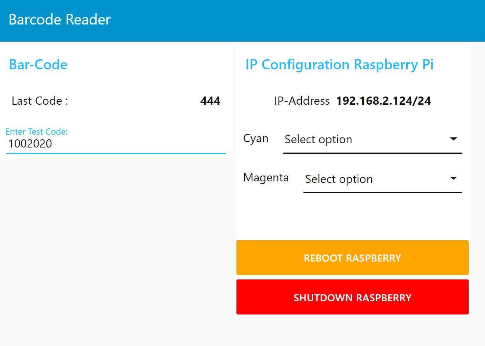

[toc] 

# RCLL-BarCodeReader
To track the workpiece flow, we introduce (2019) a product tracking system with one or two barcode-scanners on each MPS.

## Barcode Scanner
The Barcode Scanner is a simple Solution with a cheap China-Scanner over USB (Keyboard-Driver)
[SH-400](https://alexnld.com/product/scanhome-embedded-scanning-module-2d-code-barcode-scanner-head-fixed-usb-ttl-rs232-sh-400/)  
  

## Raspberrry Pi

The controller-software for the USB-Scanner is running in Node-RED (a flow based graphical framework on nodejs).  

## Installation

### Node-RED
Step | To do | Link/Picture
-- | -- | --
1 | Install Node-RED on a raspberry pi | [Installation](https://nodered.org/docs/getting-started/raspberrypi)
2 | [Import](https://nodered.org/docs/user-guide/editor/workspace/import-export) the following in nodered | [BarCodeScanner.json](./BarCodeScannerNR.json)
3 | [Add](https://nodered.org/docs/user-guide/runtime/adding-nodes) the 2 missing nodes to the palette | [Dashboard](https://flows.nodered.org/node/node-red-dashboard) & [opcua](https://flows.nodered.org/node/node-red-contrib-opcua)

### Raspberry Pi Configuration
Step | To do | Link/Picture
-- | -- | --
1 | Open Webbrowser an enter the URL (IP of Raspi) | http://[IP_Raspi]:1880/ui)
2 | Select the corresponding Station | 
3 | Reboot Raspberry Pi | 

After setting up the station and pressing reboot, the raspberry pi changes his static IP and OPC UA Endpoint to the chosen MPS.

### Barcode Scanner Configuration
- Make sure the barcodescanner is in the right mode
- Scan the QR code sequence (successfully scanned codes are shown with an acoustic signal)
- Settings are automatically saved after the scanning  

In the UI you can check the last readed code or you can force an own test code.
This codes ar written to the corresponding OPC-UA-Job/Register on the MPS.